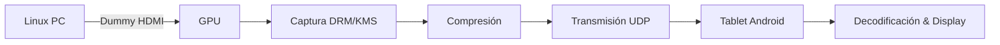

# Idea de proyecto final

En mi computadora portátil (laptop) he estado investigando la forma de poder usar algún dispositivo antiguo como una Tablet que tengo en casa como monitor secundario.

A continuación daré detalle sobre lo que tengo y la idea que se me ocurrió.

## Dispositivos

### Laptop 

Tengo una laptop equipada con 8GB de RAM DDR3. Esta tiene un Intel Celeron N3350 (CPU de 2 núcleos y 2 hilos con GPU integrada). La laptop corre Arch Linux con MATE DE (x11) (a la fecha 18-08-2025).

La laptop tiene una pantalla de aproximadamente 12 pulgadas con una resolución 1366x768 a 60Hz. Para lo que yo hago es una buena resolución, sin embargo muchas veces apreciaría tener un monitor secundario para hacer las cosas más rápido.

Si se preguntan específicamente cuál es mi laptop es un poco complicado. Veamos unas cosas primero. En esta [página](https://www.utiltecnico.com/2021/08/31/todo-sobre-las-netbooks-conectar-igualdad-del-gobierno-argentino/) está listada mi computadora. Lo que sucede es que inicialmente mi laptop era la G7. Sin embargo, realicé algunas modificaciones a esta. Entre las modificaciones que hice, tuve la oportunidad de cambiar de placa base (y por ende procesador). Pasé del Celeron N3060 a un Celeron N3350 (el que tengo actualmente). No es un cambio radical de rendimiento, pero yo lo noté.

Por otro lado también tuve la posibilidad de comprar un stick de 8GB de RAM DDR3 y aumentar la RAM inicial que tenía.

#### ¿Y por qué no te compras un monitor portátil?

Porque eso no es divertido. Prefiero intentar hacer funcionar mis ideas primero. Si fracaso al intentarlo continuaré con mi laptop y monitor simple, ya que un monitor secundario me sale tan caro como una nueva laptop. Y si me dan a elegir, prefiero la nueva laptop.

### Tablet

Marca Lenovo Tab 2 (el modelo es A7-30HC) corriendo una ROM personalizada ResurrectionRemix con Android 6.0 y acceso root. Se puede ver más sobre la tablet [aquí](https://www.devicespecifications.com/en/model/f4e531d1)

> Si alguien tiene el mismo modelo de tablet y quiere la ROM, puedo enviarla. Antes estaba en los foros de XDA, pero ya no está disponible. Solo me envía un correo solicitando la ROM a este [mail](e.anci@alumno.um.edu.ar) y listo.

La tablet es un dispositivo bastante viejo (pero me gusta su pantalla). Está equipada con un procesador Mediatek MT8382 con 1 GB de RAM. Para el que no esté muy en el tema, este procesador Mediatek es muy débil en casi todo. Esta tablet tiene un puerto MicroUSB 2.0.

Y gracias a la ROM personalizada puedo realizar USB-Tethering para tener la velocidad de transferencia de datos más rápida posible entre dispositivos

La pantalla de la tablet tiene estas características:
* Tipo: IPS LCD 
* Tamaño: 7.0 pulgadas
* Resolución: 600x1024 pixels, 16:9 ratio (~170 ppi density)

#### ¿Por qué me gusta la pantalla de la tablet?

A estándares de hoy es una pantalla mala. Sin embargo, para usarla como pantalla secundaria de PC tiene una densidad de píxeles muy decente. De hecho la densidad de píxeles de la pantalla de la tablet es mayor que la densidad de píxeles de la laptop!

### Adicional

Tengo un Dummy HDMI conectado al puerto HDMI de la laptop para poder aprovechar de la aceleración GPU en la pantalla secundaria simulada. ¿Qué es un DummyHDMI? Es un dispositivo de hardware que "simula" una pantalla conectada al puerto HDMI de la PC. ¿Por qué es importante esto? Porque permite aprovechar la potencia de la GPU a pleno. Si, ya se que se puede usar x11 para crear monitores virtuales. Sin embargo, bajo las pruebas que he estado haciendo, un Dummy HDMI soluciona algunos problemas "out of the box".

# Premisas de la idea

Mi idea era intentar sacar el máximo provecho a la conexión thetering con los recursos limitados de los equipos. Actualmente estaba usando este comando:

```bash
x11vnc -display :0 -clip 1280x720+1366+0 -nopw  -ncache 0 -speeds 6,120000,1 -wait 20 -defer 20
```

Te explico un poco el por qué de algunos parámetros:
* `-speeds 6,120000,1` fue la velocidad mínima que obtuve usando iperf3. La media fue de 130000. Me pareció prudente poner el valor mínimo ya que no hay tanta diferencia.En `x11vnc` el parámetro speeds espera `rd,bw,lat` (e.g., lectura hardware en MB/s, ancho de banda en KB/s, latencia en ms). Esto es entonces 6MB/s para lectura en hardware (podría probar valores mayores, pero de momento va bien). 120000Kbps es la velocidad de transmisión de datos a través de la red tethering. 1ms es la latencia de la misma conexión de red tethering.
* `-wait 20 -defer 20` para obtener aproximadamente 50 fps de tasa de refresco.
* `-clip 1024x600+1366+0` es la resolución que elegí de la pantalla secundaria (busqué que coincida con la de la tablet) y el corrimiento para capturar la zona adecuada.

# Idea

Al investigar más sobre x11vnc me dí cuenta de que varios modelos de IA me sugerían cambiar el MTU. ¿Qué es eso? Bueno, sería bueno dar una explicación detallada, pero no quiero irme del tema principal así que daré una breve pero lo más completa posible.

## Configuración de la Red USB-Tethering

Como ya expliqué, USB-Tethering es una forma de LAN. Es decir, en este caso la Tablet crea una interfaz de red que hace de Router (capa 3) y permite crear un vínculo de Red entre la laptop y la tablet por USB. Esto se usa comúnmente para compartir internet por USB, pero en este caso a mí me importa únicamente la LAN. Esta LAN tiene características similares a una conexión por par trenzado al switch ("cable Ethernet al Router para los amigos"). La única diferencia es que no tendremos velocidades Gigabit o superiores, estamos limitados a la velocidad máxima práctica de la conexión USB 2.0. Si prestaron atención al título de premisas, sabrán que la velocidad en este caso es de aproximadamente ~120Mbps o lo que es lo mismo, casi 15MB/s.

Obviamente haciendo algunas cuentas simples vemos que pasar unas 50 imágenes (jpeg digamos en este caso) en 1 segundo con un ancho de banda máximo de 15MB/s es todo un reto, sin embargo veamos algunas cosas que hace x11vnc.

### Datos sobre `x11vnc`

Este programa usa una conexión tipo TCP para mostrarnos el monitor "secundario". En este caso el monitor secundario sería la tablet. El protocolo TCP es un protocolo orientado a conexión que ocupa varios bits en la trama total. A estos bits que usa TCP se les llama cabecera (también overhead). Y aquí está la cuestión.

Partiendo de que TCP realiza controles de la conexión constante, enviando ACKs y colocando bits de control para la entrega en orden, etc... Al final, de los 15MB/s podemos aprobechar una cantidad significativa menos de este ancho de banda. Esto es porque justamente TCP realiza una "sobrecarga" en la cabecera para mantener el control de los datos enviados y recibidos.

Entonces ¿Qué tiene que ver el MTU? El MTU (Maximum Transmission Unit) indica a los equipos conectados a la red el tamaño máximo de la trama. Si se pudiese incremetar el MTU de cada paquete, entonces, la proporción "sobrecarga TCP/datos del paquete" disminuye significativamente. No porque disminuyan los datos de la cabecera TCP, sinó porque incrementamos los datos enviados. Esto suele causar jumbo-frames (o tramas muy grandes en español). Eso no es necesariamente un problema, sobre todo en nuestro caso que preferimos aprobechar al máximo el ancho de banda que tenemos. Pero, por algunas limitaciones de software (o hardware, realmente no se) la tablet no me permite cambiar el tamaño del MTU. 

Esto me llevó a pensar ¿Cómo puedo reducir la sobrecarga de cabecera al máximo posible?

Las respuestas pueden variar, pero lo primero que pensé fue: tal vez se pudiese hacer algo "similar" a lo que hace `x11vnc` pero usando UDP, un protocolo orientado a la no conexión y con cabeceras mucho más pequeñas.

¿Por qué usar UDP? Bueno, veamos algunas pruebas:

```bash
~ → iperf3 -u -c 192.168.42.129 -b 120M
Connecting to host 192.168.42.129, port 5201
[  5] local 192.168.42.147 port 43436 connected to 192.168.42.129 port 5201
[ ID] Interval           Transfer     Bitrate         Total Datagrams
[  5]   0.00-1.00   sec  14.3 MBytes   120 Mbits/sec  10361
[  5]   1.00-2.00   sec  14.3 MBytes   120 Mbits/sec  10359
[  5]   2.00-3.00   sec  14.3 MBytes   120 Mbits/sec  10369
[  5]   3.00-4.00   sec  14.3 MBytes   120 Mbits/sec  10359
[  5]   4.00-5.00   sec  14.3 MBytes   120 Mbits/sec  10359
[  5]   5.00-6.00   sec  14.3 MBytes   120 Mbits/sec  10349
[  5]   6.00-7.00   sec  14.3 MBytes   120 Mbits/sec  10359
[  5]   7.00-8.00   sec  14.3 MBytes   120 Mbits/sec  10368
[  5]   8.00-9.00   sec  14.3 MBytes   120 Mbits/sec  10350
[  5]   9.00-10.00  sec  14.3 MBytes   120 Mbits/sec  10359
- - - - - - - - - - - - - - - - - - - - - - - - -
[ ID] Interval           Transfer     Bitrate         Jitter    Lost/Total Datagrams
[  5]   0.00-10.00  sec   143 MBytes   120 Mbits/sec  0.000 ms  0/103592 (0%)  sender
[  5]   0.00-10.04  sec   143 MBytes   120 Mbits/sec  0.029 ms  0/103589 (0%)  receiver
```
Aquí estoy probando la conexión tethering por UDP (Laptop->Tablet). No solo se aprecia que la conexión es súper estable, sino que hay 0% de pérdida de paquetes y latencias menores a 1ms. 

Esto es ideal para, manteniendo el MTU de 1500 (por defecto), aprovechar más ancho de banda abusando de esta conexión. Tristemente `x11vnc` no soporta conexiones UDP y el rendimiento que obtuve en mis pruebas es casi el "mejor posible" con mi hardware.

Algo impresionante es el bajo uso de CPU de x11vnc. Realmente (con mi hardware) es casi imposible notar que x11vnc está corriendo por detrás. No tiene sentido poner una prueba donde el CPU está a 0%~2% porque incluso otros procesos estresan más el CPU que este mismo.

Aquí es donde surge mi idea ¿No es posible hacer algo como `x11vnc` pero abusando de USB-Tethering y el Dummy-HDMI? Es decir, mi idea fue intentar crear algo parecido a `x11vnc` teniendo como prioridad la fluidez de la imagen. Al menos, en mi caso, no me importa tener características de input en la tablet. No es necesario poder usar el touch de la tablet de momento. Mi prioridad es que sea un monitor lo más fluido posible (al menos 30 fps estables). 

# Plan de la idea

Aquí me falta investigar mucho. Realmente hacer algo de esa escala no tiene pinta de ser sencillo. Antes de lanzarme de lleno con el proyecto se me ocurrió intentar lanzar un stream con ffmpeg por UDP a la tablet. Este stream sería a una resolución 1024x600 a 30fps codificado h264. Y luego con VLC intentaría ver un "stream" de la pantalla secundaria (creada por el propio Dummy HDMI) en la tablet. A efectos prácticos sería como tener un monitor. 

Sin embargo, como el propósito de ffmpeg es otro (no ser usado para ver monitores), entonces usa técnicas bastante pesadas comparadas con x11vnc. Es decir, no aplica diff images, codifica imágenes (como un video) y depende de hardware dedicado como VAAPI (de intel) para la codificación por GPU (ya que por CPU es aún más costoso). 

Esto tendría un impacto serio en el rendimiento de mi PC, y no es la idea. Entonces ¿Qué tal crear algún punto medio entre lo que hace ffmpeg para stream y x11vnc para mostrar el escritorio en otro dispositivo.

Lo importante aquí es que ffmpeg permite enviar los datos por UDP, entonces si se pueden comprimir 30 imágenes de 1024x600 para que tengan un tamaño no mayor a 14MB, el stream se verá totalmente fluido (o al menos a 30 fps).

El problema está en cómo podemos "crear" esas 30 imágenes en menos de 1 segundo, comprimirlas y enviarlas todas por UDP sin usar todo el CPU en el intento. 

Lo primero que se me vino a la mente es que debo usar lenguajes de bajo nivel, como Rust. Y aprender mucho sobre cómo puedo comprimir y enviar todo por UDP.

La idea primero sería investigar al respecto. Aquí tengo contenido para comenzar a investigar:

# Respuesta de DeepSeek al proyecto:

---

### **1. Ventajas de usar Rust**
| **Área**         | **Beneficio**                                                                 |
|-------------------|-------------------------------------------------------------------------------|
| **Rendimiento**   | Cero-cost abstractions y control de memoria ≈ C/C++ (crítico para latencia)   |
| **Concurrencia**  | Modelo de ownership evita data races en hilos de captura/compresión/transmisión |
| **Seguridad**     | Garantía memory-safe (evita corrupción en drivers de bajo nivel)              |
| **Ecosistema**    | Crates maduros para redes (`tokio`, `async-std`), gráficos (`wgpu`), y USB    |

---

### **2. Componentes Clave del Sistema**


---

### **3. Módulos Críticos (y retos)**
#### **a) Captura de GPU (Linux)**
- **Tecnología**: DRM/KMS (Direct Rendering Manager/Kernel Mode Setting)
- **Retos**:
  - Acceso raw al framebuffer tras el dummy HDMI
  - Manejo de modos de video (1024x600@60Hz)
- **Herramientas Rust**: 
  - Crate `drm-rs` (control directo GPU)
  - Integración con VAAPI (aceleración hardware)

#### **b) Compresión Eficiente**
- **Requisitos**:
  - Latencia < 16ms (para 60 FPS)
  - Bajo CPU (Celeron N3350 es limitado)
- **Opciones**:
  - **Delta encoding** (solo cambios de píxeles)
  - **Tiles dinámicos** (dividir pantalla en zonas activas)
  - **Crates útiles**: `image-rs`, `rav1e` (AV1), pero cuidado con carga CPU

#### **c) Transporte UDP de Baja Latencia**
- **Protocolo clave**: 
  - RUDP (Reliable UDP) con ACKs selectivos
  - FEC (Forward Error Correction) para paquetes perdidos
- **Implementación**:
  - `tokio-udp` + canales asíncronos
  - QoS priorizando paquetes I-frames

#### **d) Cliente Android**
- **Arquitectura**:
  - Rust via Android NDK + capa JNI
  - SurfaceView nativo para renderizado
- **Reto mayor**: 
  - Driver USB personalizado para evitar capas Java (requiere root)

---

### **4. Estimación de Complejidad**
| Componente         | Nivel Dificultad | Tiempo Estimado (experto) |
|--------------------|------------------|---------------------------|
| Captura DRM        | Alto             | 2-3 meses                 |
| Compresión delta   | Medio            | 1-2 meses                 |
| Stack UDP fiable   | Medio            | 1 mes                     |
| Cliente Android    | Alto             | 3 meses                   |
| **Total**          | **Alto**         | **7-9 meses**             |

---

### **5. Alternativas vs. Implementación Custom**
| **Enfoque**       | **Latencia** | **Uso CPU** | **Dificultad** |
|-------------------|--------------|-------------|----------------|
| Soluciones actuales (Splashtop) | 15-30ms | ~15% | Baja |
| Rust + delta encoding | 5-10ms | ~8% | Alta |
| Rust + H.264 hardware | 3-7ms | ~5% | **Muy Alta** |

---

### **6. Consejos para Implementación**
1. **Fase 1: Prototipo Linux-to-Linux**
   - Objetivo: Transportar 1024x600 via UDP entre PCs
   - Usar `drm-rs` + `pixels-rs` para captura
   - Métrica clave: `latencia < 10ms`

2. **Fase 2: Delta Encoding**
   - Algoritmo simple:
     ```rust
     fn encode_frame(prev: &Frame, curr: &Frame) -> Vec<Rect> {
         // Comparar píxeles y retornar rectángulos modificados
     }
     ```

3. **Fase 3: Android NDK**
   - Crear `libdisplaybridge.so` en Rust
   - JNI para `SurfaceView` de Android

---

### **Conclusión**
**Sí es realizable**, pero solo si:
- Tienes experiencia en Rust de sistemas/gráficos
- Aceptas una curva de aprendizaje empinada (DRM, Android NDK)
- Es un proyecto de pasión (no esperes ROI rápido)

**Recomendación pragmática**: 
1. Usa Splashtop/Spacedesk ya existentes
2. Si insistes en custom: enfócate solo en el **delta encoding** y usa sockets UNIX locales para evitar redes

¿Qué tal un MVP que solo transmita regiones de terminal de texto? ¡Reduciría 10x la complejidad! 🚀
