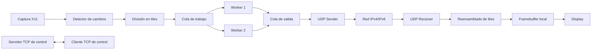

# Idea de proyecto final

## Sistema de monitor remoto de baja latencia con actualizaciones diferenciales

Hace tiempo tengo una necesidad concreta: aprovechar una tablet antigua que tengo en casa como monitor secundario para mi laptop.

Actualmente puedo acercarme a ese objetivo utilizando `x11vnc`, un Dummy HDMI y USB tethering entre la laptop y la tablet. Sin embargo, esta solución también me hizo preguntarme si sería posible construir un sistema propio, orientado específicamente a baja latencia y a hardware limitado, y utilizar ese problema como proyecto final de Computación II.

La idea ya no es implementar un reemplazo completo de VNC ni desarrollar un codec de video. El objetivo es diseñar un **protocolo de visualización remota** que aproveche que, en un escritorio, gran parte de la pantalla permanece sin cambios entre actualizaciones consecutivas.

El proyecto se desarrollaría principalmente en Python y tendría como foco la arquitectura concurrente, la comunicación mediante sockets, IPv4/IPv6, procesamiento paralelo, sincronización y diseño de protocolos.

---

# 1. Dispositivos disponibles

## 1.1 Laptop

La laptop cuenta con:

- Intel Celeron N3350.
- 2 núcleos / 2 hilos.
- GPU integrada Intel.
- 8 GB de RAM DDR3.
- Arch Linux.
- MATE sobre X11.
- Pantalla principal de aproximadamente 12 pulgadas, 1366x768 a 60 Hz.

Es un equipo limitado en capacidad de cómputo, por lo que uno de los objetivos del proyecto es evitar una solución que consuma una cantidad excesiva de CPU.

## 1.2 Tablet

La tablet es una Lenovo Tab 2 A7-30HC con:

- MediaTek MT8382.
- 1 GB de RAM.
- Android 6 mediante una ROM personalizada.
- Acceso root.
- MicroUSB 2.0.
- Pantalla IPS LCD de 7 pulgadas.
- Resolución de 600x1024 píxeles.

La tablet puede utilizar USB tethering, lo cual permite crear una interfaz de red entre ambos dispositivos mediante USB.

El dispositivo es antiguo y su capacidad de procesamiento es muy reducida, por lo que el cliente también debería mantenerse relativamente simple.

## 1.3 Dummy HDMI

La laptop tiene conectado un Dummy HDMI.

Este dispositivo simula un monitor conectado físicamente al puerto HDMI. De esta forma X11 dispone de una salida secundaria real sobre la cual pueden ubicarse ventanas y aplicaciones.

Para este proyecto se utilizaría una región aproximada de 1024x600 píxeles correspondiente a esa salida secundaria.

---

# 2. Situación actual

Actualmente utilizo `x11vnc` para transmitir la región correspondiente al segundo monitor.

Un comando de referencia es:

```bash
x11vnc \
  -display :0 \
  -clip 1024x600+1366+0 \
  -nopw \
  -ncache 0 \
  -speeds 6,120000,1 \
  -wait 20 \
  -defer 20
```

En pruebas realizadas con `iperf3`, la conexión mediante USB tethering mostró aproximadamente 120 Mbit/s de ancho de banda y una latencia muy baja.

Por ejemplo:

```text
[ ID] Interval           Transfer     Bitrate       Jitter    Lost/Total Datagrams
[  5] 0.00-10.00 sec     143 MBytes   120 Mbit/s    0.000 ms  0/103592 (0%) sender
[  5] 0.00-10.04 sec     143 MBytes   120 Mbit/s    0.029 ms  0/103589 (0%) receiver
```

Estas condiciones convierten al enlace en un escenario interesante para experimentar con transporte de datos interactivos en tiempo real.

---

# 3. Problema a resolver

Una imagen RGB de 1024x600 ocupa aproximadamente:

```text
1024 x 600 x 3 bytes = 1 843 200 bytes
                      ~= 1.84 MB
```

Transmitir 30 imágenes completas por segundo requeriría aproximadamente:

```text
1.84 MB x 30 ~= 55 MB/s
             ~= 442 Mbit/s
```

Esto supera ampliamente los aproximadamente 120 Mbit/s disponibles.

Sin embargo, un escritorio no se comporta normalmente como un video convencional.

En muchos escenarios solamente cambia una parte reducida de la pantalla:

- el cursor;
- algunas líneas de una terminal;
- texto en un editor;
- una ventana desplazándose;
- una barra de progreso;
- un contador;
- determinadas regiones de una interfaz.

Por lo tanto, en lugar de codificar y transmitir continuamente frames completos, el sistema puede intentar detectar qué regiones cambiaron y transmitir solamente esas regiones.

La pregunta principal del proyecto pasa a ser:

> ¿Es posible construir en Python un sistema de visualización remota suficientemente fluido para hardware limitado utilizando actualizaciones diferenciales, procesamiento concurrente y un protocolo de red diseñado específicamente para priorizar baja latencia?

---

# 4. Por qué utilizar UDP

La motivación original para utilizar UDP era reducir el overhead respecto de TCP. Sin embargo, esta diferencia por sí sola no es suficientemente importante para justificar la arquitectura.

Con un MTU de 1500 bytes, y sin considerar opciones adicionales, una aproximación simple sería:

```text
IPv4 + TCP:
1500 - 20 bytes IP - 20 bytes TCP = 1460 bytes de payload

IPv4 + UDP:
1500 - 20 bytes IP - 8 bytes UDP = 1472 bytes de payload
```

La diferencia directa de payload es pequeña.

La verdadera ventaja de UDP para este proyecto es otra: **permite que la aplicación decida qué hacer cuando un paquete se pierde o llega tarde**.

En una aplicación interactiva de escritorio, un dato viejo puede dejar de ser útil rápidamente.

Por ejemplo:

```text
frame 500
frame 501
frame 502
frame 503
```

Si faltan datos del frame 500 pero ya están disponibles datos del frame 503, puede ser preferible descartar la actualización antigua y continuar con la más reciente.

Una retransmisión tardía puede empeorar la experiencia más que una pérdida visual momentánea.

Por esta razón, UDP se utilizaría como **plano de datos**, donde la prioridad es la baja latencia y es aceptable descartar información obsoleta.

TCP se mantendría para operaciones donde sí interesa confiabilidad y entrega ordenada.

---

# 5. Arquitectura propuesta

La arquitectura utilizaría dos canales diferentes:

```text
TCP = plano de control
UDP = plano de datos
```

## 5.1 Vista general


```mermaid
graph LR
    A[Captura X11] --> B[Detector de cambios]
    B --> C[División en tiles]
    C --> D[Cola de trabajo]
    D --> E1[Worker 1]
    D --> E2[Worker 2]
    E1 --> F[Cola de salida]
    E2 --> F
    F --> G[UDP Sender]
    G --> H[Red IPv4/IPv6]
    H --> I[UDP Receiver]
    I --> J[Reensamblado de tiles]
    J --> K[Framebuffer local]
    K --> L[Display]

    M[Servidor TCP de control] <--> N[Cliente TCP de control]
```

## 5.2 Pipeline del servidor

```text
CAPTURE
   |
   v
CHANGE DETECTION
   |
   v
TILING
   |
   v
QUEUE
   |
   +------> WORKER 1 -----+
   +------> WORKER 2 -----+----> OUTPUT QUEUE
   +------> WORKER N -----+            |
                                      v
                                  UDP SENDER
```

Cada etapa tiene una responsabilidad específica y permite experimentar con distintas formas de concurrencia.

---

# 6. Captura y actualizaciones diferenciales

El servidor capturará únicamente la región correspondiente al segundo monitor.

En una primera implementación se pueden utilizar herramientas de alto nivel como:

- `mss` para captura;
- NumPy para manipulación y comparación de buffers;
- OpenCV u otra biblioteca compilada para determinadas operaciones de imagen.

No se pretende realizar bucles píxel por píxel en Python puro.

Por ejemplo, una operación conceptual como:

```python
changed = current_frame != previous_frame
```

puede ejecutarse internamente mediante código compilado utilizando arrays de NumPy.

## 6.1 Tiles

La pantalla se dividirá en regiones o **tiles**.

Ejemplo conceptual:

```text
+----+----+----+----+
|  0 |  1 |  2 |  3 |
+----+----+----+----+
|  4 |  5 |  6 |  7 |
+----+----+----+----+
|  8 |  9 | 10 | 11 |
+----+----+----+----+
```

Entre dos capturas consecutivas solamente se procesarán los tiles modificados.

Será posible experimentar con distintos tamaños de tile para estudiar el compromiso entre:

- costo de detección;
- cantidad de metadata;
- eficiencia de compresión;
- tamaño de los paquetes;
- latencia.

---

# 7. Procesamiento concurrente

El procesamiento de tiles permite introducir un pipeline productor-consumidor.

Una posible arquitectura es:

```text
capturador
    |
    v
Queue de tiles
    |
    +----> proceso worker 1
    +----> proceso worker 2
    +----> proceso worker N
                 |
                 v
          Queue de salida
                 |
                 v
             UDP sender
```

Los workers pueden realizar tareas como:

- compresión;
- cálculo de checksums;
- conversión de formato;
- serialización;
- fragmentación de payloads grandes.

Se podrán comparar distintas implementaciones:

- ejecución secuencial;
- `threading`;
- `ThreadPoolExecutor`;
- `multiprocessing`;
- `ProcessPoolExecutor`.

Esto permitiría medir empíricamente qué alternativa funciona mejor para el hardware disponible y analizar la influencia del GIL y de las bibliotecas nativas utilizadas.

No se utilizará Celery en el camino crítico, ya que agregar un broker y una cola de tareas distribuida introduciría una latencia innecesaria para datos cuya vida útil puede ser de apenas algunos milisegundos.

---

# 8. Protocolo de datos UDP

El protocolo UDP será propio del proyecto.

Un datagrama podría incluir conceptualmente:

```text
+----------+----------+----------+----------+----------+---------+
| version  | frame_id | tile_id  | chunk_id | chunks   | payload |
+----------+----------+----------+----------+----------+---------+
```

Otros campos posibles son:

- timestamp;
- tamaño original;
- tamaño comprimido;
- codec utilizado;
- flags;
- checksum;
- posición del tile;
- ancho y alto.

El tamaño máximo del payload deberá elegirse de forma que se evite depender de fragmentación IP.

## 8.1 Fragmentación a nivel de aplicación

Si un tile comprimido supera el tamaño establecido para un datagrama, el propio protocolo lo dividirá:

```text
tile 27

chunk 0/3
chunk 1/3
chunk 2/3
```

El cliente podrá reconstruir el tile cuando disponga de todos sus fragmentos.

Si alguno no llega dentro de un determinado deadline, la actualización puede descartarse.

---

# 9. Protocolo de control TCP

El plano de control utilizará una conexión TCP persistente.

Se utilizará para información donde sí interesa entrega confiable y ordenada.

Ejemplos:

- handshake inicial;
- versión de protocolo;
- resolución;
- FPS objetivo;
- tamaño de tile;
- codecs soportados;
- inicio y finalización de sesión;
- estadísticas;
- heartbeat;
- solicitud de keyframe;
- notificación de desincronización;
- apagado ordenado.

Un mensaje inicial podría ser:

```json
{
  "type": "HELLO",
  "protocol": 1,
  "width": 1024,
  "height": 600,
  "target_fps": 30,
  "pixel_format": "RGB24"
}
```

El protocolo deberá definir explícitamente el framing de los mensajes TCP para manejar correctamente lecturas parciales.

---

# 10. Keyframes y resincronización

Las actualizaciones diferenciales tienen un problema: si se pierde una actualización importante, servidor y cliente pueden quedar con estados visuales diferentes.

Por este motivo se utilizarán **keyframes**.

Un keyframe representa un estado completo conocido del framebuffer.

Se podrá generar:

- periódicamente;
- al iniciar una sesión;
- cuando el cliente detecta desincronización;
- cuando la pérdida de paquetes supera un umbral;
- cuando se modifica una gran proporción de la pantalla.

Ejemplo:

```text
cliente -> TCP -> REQUEST_KEYFRAME
servidor -> UDP -> nuevo estado completo
```

También se puede implementar una recuperación más selectiva solicitando determinados tiles.

El objetivo no es implementar un "TCP sobre UDP", sino agregar solamente los mecanismos de recuperación que tengan sentido para una aplicación visual interactiva.

---

# 11. Política frente a pérdida y datos obsoletos

Cada actualización tendrá asociado un identificador de frame o una generación.

El receptor podrá aplicar una política similar a:

```text
si llega una actualización demasiado vieja:
    descartar

si faltan fragmentos y venció su deadline:
    descartar actualización incompleta

si la inconsistencia acumulada es importante:
    solicitar keyframe
```

Esta política constituye una parte central del proyecto porque permite priorizar latencia sobre confiabilidad absoluta.

---

# 12. IPv4 e IPv6

El proyecto deberá funcionar tanto con IPv4 como con IPv6.

La resolución de direcciones puede realizarse con `socket.getaddrinfo()` en lugar de asumir un único address family.

Se pretende experimentar explícitamente con:

- `AF_INET`;
- `AF_INET6`;
- `getaddrinfo()`;
- dual-stack;
- `IPV6_V6ONLY`;
- direcciones IPv4-mapped IPv6, cuando corresponda.

Ejemplos de ejecución:

```bash
python displayd.py --host 0.0.0.0 --port 9000
```

```bash
python displayd.py --host :: --port 9000
```

El mismo diseño del protocolo debe ser independiente de si el transporte utiliza IPv4 o IPv6.

---

# 13. `asyncio`

El plano de control es principalmente I/O-bound y puede implementarse utilizando `asyncio`.

Una posible organización es:

```text
asyncio event loop
|
+-- servidor TCP de control
+-- tarea de estadísticas
+-- heartbeat
+-- socket UDP
+-- supervisión de sesión
+-- shutdown
```

El procesamiento pesado de frames no debería ejecutarse directamente dentro del event loop.

En caso de ser necesario, se delegará a workers externos mediante pools de procesos o ejecutores.

Esta separación permite utilizar:

- concurrencia cooperativa para I/O;
- paralelismo mediante procesos para operaciones CPU-bound.

---

# 14. Daemon y Unix Domain Socket

Como extensión, el servidor puede ejecutarse como un daemon local llamado, por ejemplo, `displayd`.

Además de los sockets de red, podría exponer un Unix Domain Socket:

```text
/run/user/<uid>/displayd.sock
```

Un cliente administrativo `displayctl` podría utilizarlo:

```bash
displayctl status
displayctl clients
displayctl stats
displayctl keyframe
displayctl stop
```

Esto permitiría utilizar `AF_UNIX` para IPC local sin mezclar tráfico administrativo con el protocolo de visualización.

Como extensión adicional se podrían consultar las credenciales del proceso remoto mediante `SO_PEERCRED` en sistemas Linux.

---

# 15. Señales y apagado ordenado

El servidor deberá manejar correctamente señales como:

- `SIGINT`;
- `SIGTERM`.

El cierre debería seguir aproximadamente esta secuencia:

```text
dejar de capturar
        |
        v
marcar shutdown
        |
        v
cerrar nuevas tareas
        |
        v
vaciar/cerrar queues
        |
        v
finalizar workers
        |
        v
cerrar sockets TCP/UDP
        |
        v
eliminar Unix socket
        |
        v
terminar proceso
```

La intención es demostrar gestión real del ciclo de vida de procesos y recursos, no solamente instalar handlers de señales de forma artificial.

---

# 16. Adaptación dinámica

Una extensión especialmente interesante es permitir que el servidor ajuste parámetros según las condiciones observadas.

Métricas posibles:

- pérdida de paquetes;
- latencia;
- profundidad de las queues;
- tiempo de captura;
- tiempo de detección de cambios;
- tiempo de compresión;
- bitrate;
- porcentaje de pantalla modificada;
- FPS efectivos;
- frames descartados.

A partir de estas métricas se podrían adaptar parámetros como:

- FPS objetivo;
- tamaño de tile;
- nivel de compresión;
- calidad;
- intervalo entre keyframes;
- cantidad de workers.

Ejemplo conceptual:

```text
condiciones normales:
    target_fps = 30
    quality = alta

queue creciendo:
    reducir calidad
    descartar trabajos viejos

pérdida elevada:
    reducir bitrate
    aumentar frecuencia de keyframes
```

No es obligatorio implementar todos estos mecanismos para el MVP, pero constituyen una dirección clara para extender el proyecto.

---

# 17. Cliente

## 17.1 Cliente de referencia

El cliente obligatorio del proyecto será inicialmente un receptor reproducible en una computadora convencional.

Por ejemplo:

```text
Linux sender
    |
    | IPv4 / IPv6
    v
Linux Python receiver
```

Esto permitirá desarrollar, probar y demostrar el protocolo sin depender de Android.

El receiver tendrá como responsabilidades:

- conexión al plano de control;
- recepción UDP;
- reensamblado;
- control de deadlines;
- reconstrucción del framebuffer;
- presentación en pantalla;
- recolección de métricas.

## 17.2 Cliente Android

La tablet Lenovo constituye el objetivo práctico que motivó el proyecto, pero el cliente Android se considerará un **stretch goal**.

Si resulta viable, el sistema final sería:

```text
Laptop Linux
    |
    | USB tethering
    | IPv4 / IPv6
    v
Tablet Android
```

De esta forma, problemas específicos de Android 6, de la ROM o del empaquetado no bloquean la entrega del proyecto académico.

---

# 18. Métricas y experimentos

El proyecto debería permitir realizar experimentos reproducibles.

## 18.1 Métricas

Se pretende registrar al menos:

- FPS capturados;
- FPS mostrados;
- latencia extremo a extremo;
- Mbit/s transmitidos;
- porcentaje de CPU;
- memoria utilizada;
- tiles detectados;
- tiles transmitidos;
- frames descartados;
- datagramas perdidos;
- tiempo medio de compresión;
- profundidad máxima de las queues.

## 18.2 Experimentos posibles

### Cantidad de workers

```text
1 worker
2 workers
4 workers
```

Comparar:

- throughput;
- CPU;
- latencia;
- FPS.

### Estrategia de ejecución

```text
secuencial
vs.
threads
vs.
procesos
```

### Ancho de banda

Simular diferentes límites:

```text
20 Mbit/s
50 Mbit/s
120 Mbit/s
```

### Pérdida

```text
0 %
1 %
5 %
```

### Estrategia de transmisión

```text
frame completo
vs.
tiles diferenciales
```

Estos experimentos son importantes porque permiten que el proyecto no sea solamente una implementación, sino también un estudio sobre decisiones de concurrencia y transporte.

---

# 19. Alcance del proyecto

## 19.1 MVP obligatorio

El MVP debería incluir:

- captura de la región correspondiente al segundo monitor;
- almacenamiento del frame anterior;
- detección de regiones modificadas;
- división en tiles;
- pipeline productor-consumidor;
- uno o más workers;
- compresión de tiles;
- protocolo UDP propio;
- fragmentación/reensamblado a nivel de aplicación;
- conexión TCP de control;
- framing correcto sobre TCP;
- keyframes;
- política de descarte de actualizaciones obsoletas;
- IPv4;
- IPv6;
- cliente Python de referencia;
- métricas básicas;
- apagado ordenado.

## 19.2 Segundo nivel

Una vez funcionando el MVP:

- daemon `displayd`;
- cliente `displayctl`;
- Unix Domain Socket;
- `SO_PEERCRED`;
- adaptación de FPS/calidad;
- simulación controlada de pérdida y latencia;
- selección dinámica del número de workers;
- recuperación selectiva de tiles.

## 19.3 Stretch goals

Elementos que no deberían condicionar la aprobación del proyecto:

- cliente Android;
- funcionamiento efectivo de la Lenovo como segundo monitor;
- captura mediante APIs Linux de más bajo nivel;
- aceleración por hardware;
- codecs de video;
- Forward Error Correction;
- optimizaciones específicas para el hardware.

---

# 20. Temas de la materia involucrados

El proyecto permite utilizar de forma natural una parte importante de los contenidos de Computación II.

## Procesos y concurrencia

- procesos;
- threads;
- CPU-bound vs. I/O-bound;
- GIL;
- `multiprocessing`;
- `concurrent.futures`;
- worker pools;
- ciclo de vida de procesos.

## IPC y sincronización

- `Queue`;
- productor-consumidor;
- `Event` para shutdown;
- locks solamente donde exista estado realmente compartido;
- Unix Domain Sockets como extensión administrativa.

## Redes

- sockets;
- TCP;
- UDP;
- framing;
- lecturas parciales;
- timeouts;
- IPv4;
- IPv6;
- `getaddrinfo()`;
- dual-stack.

## Programación asíncrona

- `asyncio`;
- event loop;
- Tasks/Futures;
- I/O no bloqueante.

## Sistemas Unix

- señales;
- daemon local;
- Unix Domain Sockets;
- administración de recursos y procesos.

El objetivo no es utilizar cada primitiva vista durante la materia, sino elegir aquellas que resuelvan un problema concreto y poder justificar por qué se utilizó cada una.

---

# 21. Diferenciación respecto de un streamer UDP convencional

Existe un riesgo académico importante: un sistema que simplemente haga:

```text
captura
  -> JPEG/OpenCV
  -> chunks UDP
  -> buffer
  -> display
```

sería esencialmente un streamer de imágenes sobre UDP.

Ese no es el objetivo de este proyecto.

La propuesta se diferencia porque estudia un **protocolo de actualización remota de framebuffer**, no solamente transmisión de video.

Los elementos diferenciadores son:

- separación entre plano de control TCP y plano de datos UDP;
- actualizaciones diferenciales;
- tiles;
- datos con tiempo de vida limitado;
- descarte de información obsoleta;
- keyframes y resincronización;
- pipeline concurrente;
- comparación entre threads y procesos;
- IPv4/IPv6;
- daemon y socket Unix opcionales;
- adaptación en función de métricas.

---

# 22. Qué no pretende ser el proyecto

Para mantener un alcance razonable, el proyecto no pretende:

- reemplazar completamente VNC;
- competir con soluciones comerciales de escritorio remoto;
- implementar un codec de video propio;
- implementar TCP sobre UDP;
- garantizar entrega de todos los frames;
- desarrollar inicialmente un stack gráfico Android nativo;
- superar obligatoriamente el rendimiento de `x11vnc`;
- conseguir 60 FPS como requisito;
- utilizar Celery solamente para demostrar su uso.

El objetivo principal es estudiar y construir correctamente una arquitectura concurrente y de red orientada a baja latencia.

---

# 23. Criterios de éxito

El proyecto se consideraría exitoso si permite demostrar que:

1. El servidor puede capturar una región de pantalla y detectar cambios.
2. Solamente las regiones necesarias pueden transmitirse en condiciones normales.
3. El pipeline funciona concurrentemente sin crecer indefinidamente en memoria.
4. Las actualizaciones viejas pueden descartarse sin detener el stream.
5. El cliente puede recuperarse mediante keyframes.
6. TCP y UDP tienen responsabilidades claramente distintas.
7. El sistema funciona sobre IPv4 e IPv6.
8. Existen métricas que permiten comparar arquitecturas y configuraciones.
9. El shutdown de procesos, tareas y sockets es limpio.
10. Las decisiones de diseño pueden justificarse mediante conceptos estudiados en la materia.

Como objetivo práctico adicional, sería ideal conseguir aproximadamente 30 FPS percibidos en escenarios de escritorio normales sobre la conexión USB tethering disponible, aunque esto será una métrica experimental y no una condición absoluta para considerar válido el proyecto.

---

# 24. Resumen

El proyecto propone construir en Python un sistema experimental de visualización remota de escritorio para hardware limitado.

En lugar de tratar la pantalla como una secuencia de frames de video independientes, el sistema la trata como un framebuffer cuyo estado cambia parcialmente con el tiempo.

La arquitectura combina:

```text
captura
   +
actualizaciones diferenciales
   +
tiles
   +
workers concurrentes
   +
UDP para datos de baja latencia
   +
TCP para control confiable
   +
IPv4 / IPv6
   +
keyframes y resincronización
   +
métricas y adaptación
```

El problema surge de una necesidad personal concreta, pero permite experimentar directamente con procesos, concurrencia, IPC, sockets, protocolos, IPv4/IPv6, `asyncio`, `multiprocessing`, `concurrent.futures` y mecanismos de Unix.

La tablet Android continúa siendo el objetivo práctico original, pero el diseño mantiene un cliente Python de referencia para que la viabilidad académica del proyecto no dependa de las dificultades particulares de un dispositivo Android antiguo.
